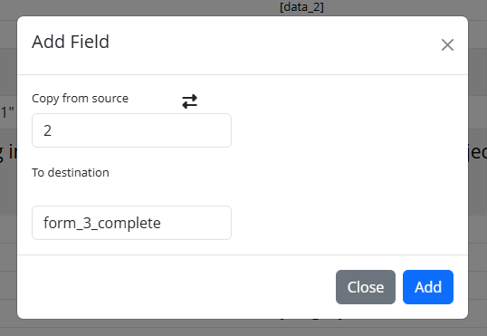

# Data Entry Trigger Builder Instructions

Make sure the module has been enabled in your project. Next, navigate to External Modules in your REDCap sidebar. Only administrators can see the link.

1.Select your destination project

Your current project is automatically used as the source. If you have DET settings exported from another project, you may import them here.

2.Select the record linkage fields

Determine the fields that link your source and destination records. These fields are used to determine which destination record will be updated when at least one trigger condition is met.

3.Add a trigger expression

Multiple conditions can be chained in one trigger using && (AND), or || (OR). See the table attached to the module,  for allowed qualifiers. 

4.Add data to move when the trigger condition is true

5.
    1. Instrument transfers
    
    Instrument-to-instrument transfer requires a one-to-one mapping: All fields in the source instrument must exist in the destination instrument.
    Supported project transfers from Source -> Target:
    - classic -> classic
    - classic -> longitudinal
    - longitudinal -> longitudinal 
    
    **Note:** Destination Event Priority

    If multiple event inputs exist, the module prioritizes target event selection as follows:
    - Instrument/field-level destination event (highest priority)
    - Record linkage destination event (global setting) if no Instrument/field-level destination event is defined
    - No event specified (default classic behaviour) as a back-up

    2. Field transfers
    
    You can choose to pipe a field, or manually set a value to move. (i.e set completion status to ‘2’)
    

6.The module will allow up to ten triggers that each move their own data.

7.Determine whether you want blank fields to overwrite data in the destination project.

8.Determine whether you want to import DAGs to the destination project. This will only work if the DAGs are identical between projects. 

9.Save your DET. If it passes validation, then it will automatically run every time data is entered via a survey or data entry. Otherwise errors will be returned to you for correction. The DET will not save until your errors are corrected.

10.Once your DET is created, refresh the page, then you can export the settings as a JSON string.

11.The module logs all DET activity. It will log successes, warnings, and errors. You may check there whenever you want to check on the status of your DET.

# Warnings

1. Any changes made to the REDCap project, after the DET has been created, has the potential to break it. After you’ve updated your project, please make sure to update the DET in accordance with your changes.

# Limitations

1. Is not compatible with repeatable instruments.
2. Can only be used within the same instance of REDCap. 
3. Can have a maximum of 10 triggers, with unlimited data to pipe.
4. Is not compatible with mult-arm projects at the moment.
