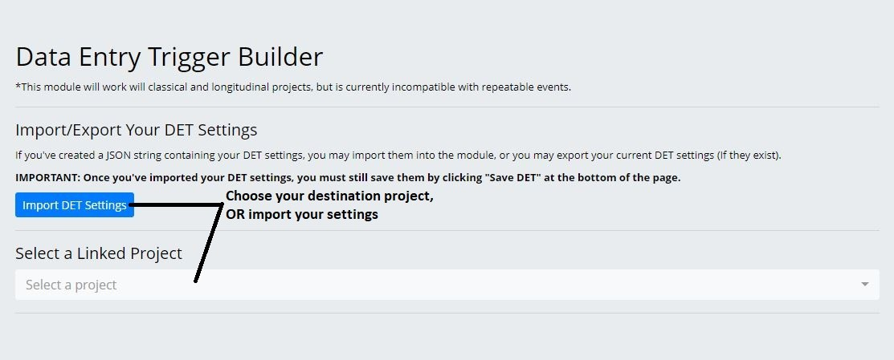
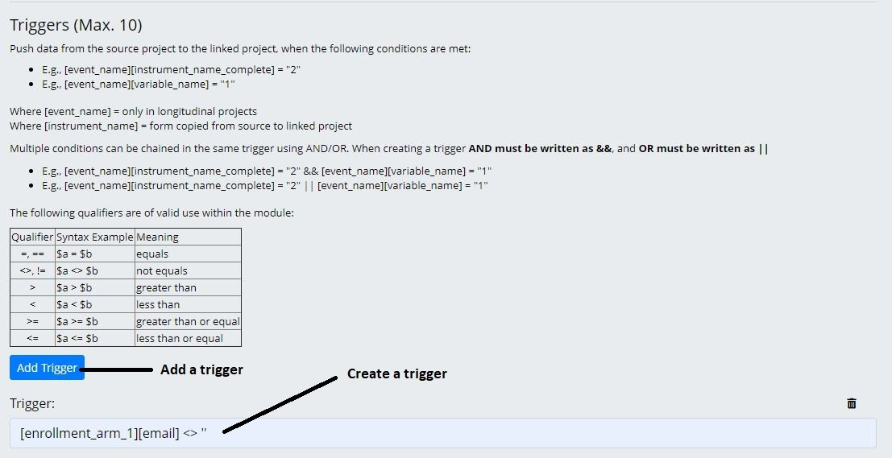
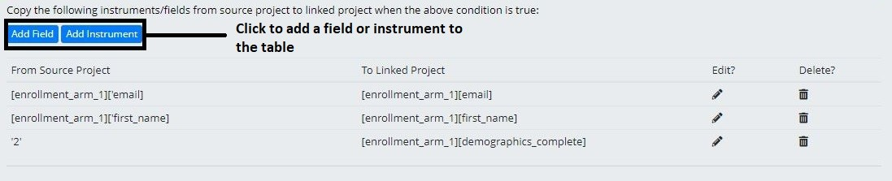
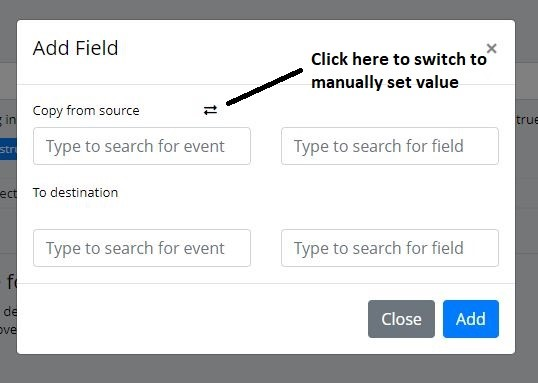
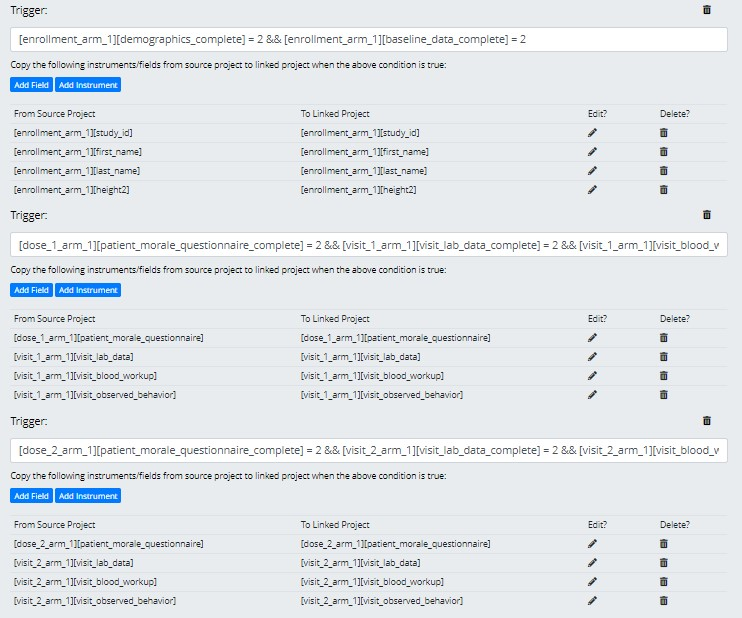
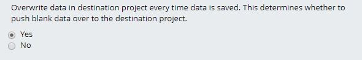
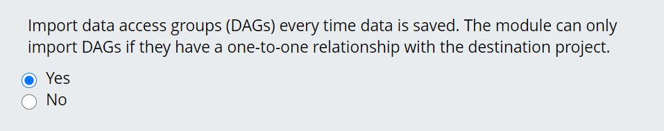

# Data Entry Trigger Builder Instructions

1. Make sure the module has been enabled in your project. After, navigate to External Modules, in your REDCap sidebar. Only administrators can see the link.

2. Select your destination project. Your current project is automatically used as the source. If you’ve exported your DET settings from another project, you may import them, instead.

3. Determine which fields you’ll use to link your source and destination projects. These fields will be used to link records between the projects, when at least one trigger condition is met.

4. Add a trigger to move data. Multiple conditions can be chained in one trigger using && (AND), or || (OR). See the table attached to the module,  for allowed qualifiers. 

5. Add data to move when the condition is true.

5.
    1. Add an instrument to move. This can only work if there’s a one-to-one relationship between the selected instrument and another instrument in the destination project. Meaning all fields in the source instrument, must exist in the destination instrument. 
    2. Add a field to move. You can choose to pipe a field, or manually set a value to move. (i.e set completion status to ‘2’)
    

6. The module will allow up to ten triggers that each move their own data.

7. Determine whether you want blank fields to overwrite data in the destination project.

8. Determine whether you want to import DAGs to the destination project. This will only work if the DAGs are identical between projects. 

9. Save your DET. If it passes validation, then it will automatically run every time data is entered via a survey or data entry. Otherwise errors will be returned to you for correction. The DET will not save until your errors are corrected.

10. Once your DET is created, refresh the page, then you can export the settings as a JSON string.

11. The module logs all DET activity. It will log successes, warnings, and errors. You may check there whenever you want to check on the status of your DET.

# Warnings

1. Any changes made to the REDCap project, after the DET has been created, has the potential to break it. After you’ve updated your project, please make sure to update the DET in accordance with your changes.

# Limitations

1. Is not compatible with repeatable instruments.
2. Can only be used within the same instance of REDCap. 
3. Can have a maximum of 10 triggers, with unlimited data to pipe.
4. Is not compatible with mult-arm projects at the moment.
