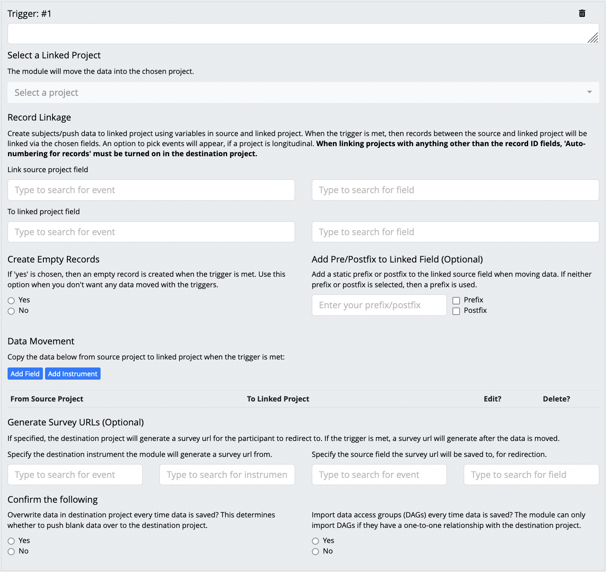
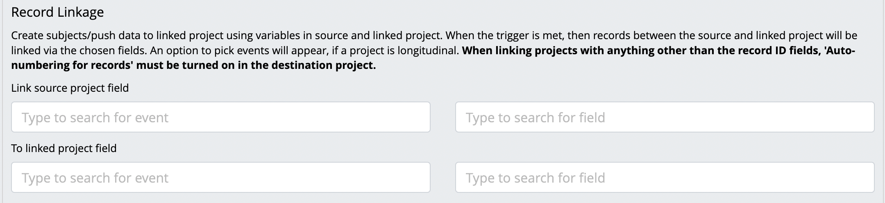
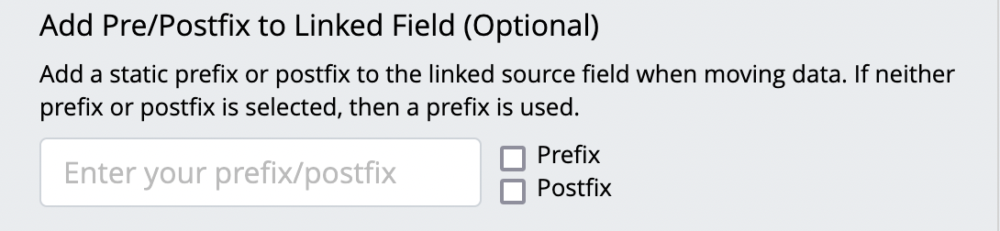

# Data Entry Trigger Builder 

## Important

When updating from < v3.0.0, you'll have to enter your previous settings again, by hand. This is because the settings are stored as JSON in REDCap, and the structure of the JSON object has changed with the upgrade to v3.0.0. The module will not function otherwise.

## Instructions

1. Make sure the module has been enabled in your project. After, navigate to External Modules, in your REDCap sidebar. Only administrators with "Access to all projects and data with maximum user privileges" can see the link.

2. Add a trigger to move data. Multiple conditions can be chained in one trigger using && (AND), or || (OR). See the table attached to the module,  for allowed qualifiers. If you’ve exported your DET settings from another project, you may import them, instead.

The following form will appear. 

Start by creating a trigger. Data movement will occur when your trigger is met.

3. Select your destination project. Your current project is automatically used as the source.

4. Determine which fields you’ll use to link your source and destination projects. These fields will be used to link records between the projects, when at least one trigger condition is met.

(OPTIONAL) Decide whether you want to append a static prefix, or postfix to the linking value.

5. Add data to move when the condition is true.

Or create an empty record

Data Movement Options:

- Add an instrument to move. All fields in the chosen instrument must exist in the destination project, for the chosen event.
- Add a field to move. You can choose to pipe a field, or manually set a value to move. (i.e set completion status to ‘2’)
    

6. (OPTIONAL) Determine whether the module will pull the url for a survey into your source project, and where to save it.

7. Determine whether you want blank fields to overwrite data in the destination project.

8. Determine whether you want to import DAGs to the destination project. This will only work if the DAGs are identical between projects. 

9. The module will allow up to 10 triggers that each move their own data.

10. Save your DET. If it passes validation, then it will automatically run every time data is entered via a survey or data entry. Otherwise errors will be returned to you for correction. The DET will not save until your errors are corrected.

11. Once your DET is created, refresh the page, then you can export the settings as a JSON string.

12. The module logs all DET errors. You may check there whenever you want to check on the status of your DET.

# Warnings

- Any changes made to the REDCap project, after the DET has been created, has the potential to break it. After you’ve updated your project, please make sure to update the DET in accordance with your changes.
- Previous functionality to export your settings to a word document has been disabled for v3.0.0, as it has not been made compatible with the new JSON structure. 

# Limitations

- Is not compatible with repeatable instruments.
- Can have a maximum of 10 triggers, with unlimited data to pipe.
